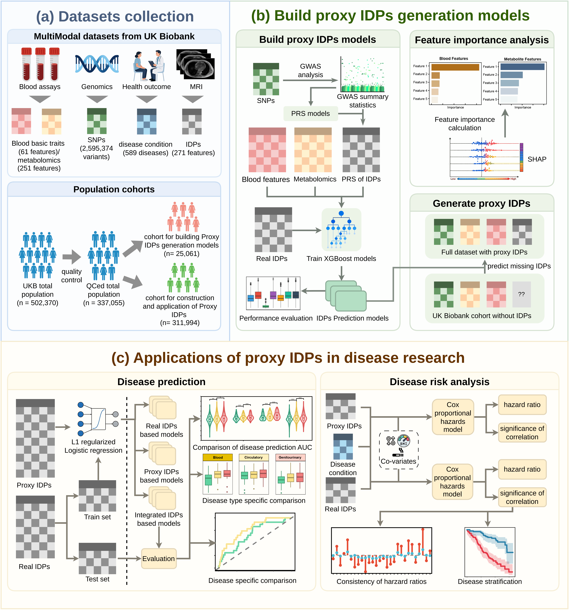

# Proxy IDPs generation and application
Code repository for research article entitled "Phenotypic reconstruction across biological scales expands imaging-based disease modeling"
# Research Framework
The figure below illustrates the overall research framework of our study.

**(a)** Multimodal data, including blood biochemistry, complete blood count measurements, genomic data, metabolomics profiles, imaging-derived phenotypes (IDPs), and disease records, were obtained from the UK Biobank. After quality control procedures, the cohort was divided into predefined subsets for subsequent analyses.

**(b)** IDP prediction models were developed using multimodal data, followed by model interpretation and evaluation. The trained models were then applied to individuals without imaging data to generate proxy IDPs.

**(c)** The generated proxy IDPs were utilized in downstream analyses, including disease prediction, survival analysis, and risk stratification, demonstrating their value for disease-related research in large-scale populations where imaging data are unavailable.

<!-- Insert framework figure here -->

---

# Repository Structure

This repository contains two major components:

1. **Multimodal data extraction and preprocessing**
2. **Experimental analyses and model development presented in the manuscript**
---
## ProxyIDP_01_DatasetsPrepare

This directory contains scripts for preparing and preprocessing all datasets except genomic data, including:

* Basic blood traits
* Disease records
* Imaging-Derived Phenotypes (IDPs)
* Metabolomics data
* Other multimodal phenotypic datasets

---

## ProxyIDP_02_Experiments

This directory contains the code used for the major experiments described in the manuscript.

### 01_generate_pgen

Performs initial genomic data preprocessing, including:

* Removal of insertion/deletion variants (INDELs)
* Detection and removal of duplicate variants
* Basic genotype data cleaning and formatting

### 02_QC_and_SelectSNPs

Performs comprehensive genomic quality control and SNP selection, including:

* Sample-level quality control
* Variant-level quality control
* Linkage disequilibrium (LD) pruning

Detailed QC procedures are described in the **Methods** section of the manuscript.

### 03_PerformGWAS

Conducts genome-wide association studies (GWAS), including:

* Genotype format conversion using **PLINK2**
* Covariate preprocessing
* GWAS analysis using **fastGWA-GLMM**, a GLMM-based GWAS tool developed by Jiang *et al.*(Jiang, L., et al. A generalized linear mixed model association tool for biobank-scale data. Nature Genetics 2021;53(11):1616-1621)

### 04_build_PGS_models

Constructs polygenic score (PGS) models for each Imaging-Derived Phenotype (IDP) based on GWAS summary statistics.

### 05_PGSmodel_application

Applies the trained PGS models to generate IDP polygenic score matrices.

This directory also includes scripts for:

* Generating genomic datasets for PGS evaluation
* Constructing testing datasets used in downstream analyses

### 06_MultiModal_IDPs_pred

Builds and evaluates multimodal blood-based models for generating **Proxy IDPs**.

This module also includes:

* Feature importance analyses based on trained prediction models
* Gene enrichment analyses for genes mapped from SNPs included in Proxy IDP polygenic scores
* Generation of datasets required for ablation studies

### 07_disease_related_analysis

Contains all disease-related analyses, including:

* Construction, evaluation, and comparison of disease prediction models based on measured IDPs and Proxy IDPs
* Cox proportional hazards regression analyses between IDPs and disease outcomes
* Risk stratification analyses
* Disease prediction experiments under controlled Proxy IDP training sample sizes
